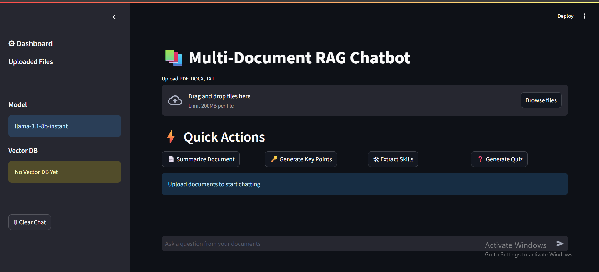
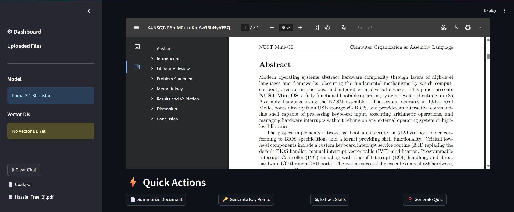
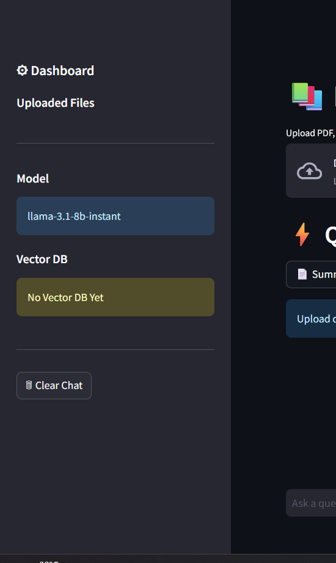

# 📚 Multi-Document RAG Chatbot

<div align="center">


An AI-powered Multi-Document RAG (Retrieval-Augmented Generation) Chatbot that enables intelligent document interaction using semantic search, vector embeddings, and Large Language Models.

</div>

---

# 🚀 Features

✅ Multi-PDF Upload  
✅ DOCX & TXT Support  
✅ Conversational AI Chat  
✅ Semantic Search  
✅ Vector Database (FAISS)  
✅ Source Citations  
✅ Retrieved Chunk Visualization  
✅ PDF Preview Panel  
✅ Chat History  
✅ Summarization  
✅ Key Point Generation  
✅ Skill Extraction  
✅ Quiz Generation  
✅ Prompt Engineered Responses  
✅ Modern Dashboard UI  

---

# 🧠 Tech Stack

| Technology | Purpose |
|---|---|
| Python | Backend |
| Streamlit | Frontend UI |
| LangChain | RAG Pipeline |
| FAISS | Vector Database |
| HuggingFace Embeddings | Semantic Embeddings |
| Groq LLM | Language Model |
| Sentence Transformers | Embedding Model |

---

# 🏗️ System Architecture

```text
User Query
     ↓
Retriever (FAISS)
     ↓
Relevant Chunks
     ↓
LLM (Groq - Llama 3.1)
     ↓
Grounded AI Response
```

---

# 📸 Application Screenshots

---

## 🖥 Dashboard



---

## 💬 Chat Response


---

## 📄 PDF Preview Panel



---

## 📚 Sidebar Dashboard



---

# ⚡ Quick Actions

The chatbot includes multiple intelligent document actions:

- 📄 Summarize Documents
- 🔑 Generate Key Points
- 🛠 Extract Skills
- ❓ Generate Quiz Questions

---

# 🧠 Prompt Engineering

Custom prompt templates are used to reduce hallucinations and ensure grounded responses.

Example:

```python
You are an AI assistant.

Answer ONLY from the provided context.

If the answer is not available in the context,
say:
"I could not find this in the uploaded documents."
```

---

# 📂 Project Structure

```bash
rag-multi-doc-chatbot/
│
├── app.py
├── requirements.txt
├── README.md
├── .gitignore
├── .env
│
├── assets/
│   ├── dashboard.png
│   ├── chat-response.png
│   ├── pdf-preview.png
│   └── sidebar.png
│
├── data/
├── vector_db/
│
└── utils/
    ├── loaders.py
    ├── vector_store.py
    └── rag_chain.py
```

---

# ⚙️ Installation

## 1️⃣ Clone Repository

```bash
git clone https://github.com/AliMurad0/Multi-document-rag-chatbot.git

cd Multi-document-rag-chatbot
```

---

## 2️⃣ Create Virtual Environment

### Windows

```bash
python -m venv venv
venv\Scripts\activate
```

### Mac/Linux

```bash
python3 -m venv venv
source venv/bin/activate
```

---

## 3️⃣ Install Dependencies

```bash
pip install -r requirements.txt
```

---

# 🔑 Environment Variables

Create a `.env` file:

```env
GROQ_API_KEY=your_api_key_here
```

---

# ▶️ Run Application

```bash
python -m streamlit run app.py
```

---

# 📌 Future Improvements

- 🔐 User Authentication
- 🌐 Multi-language Support
- ⚡ Streaming Responses
- 🐳 Docker Deployment
- ☁ Cloud Vector Databases
- 📊 Analytics Dashboard
- 🔎 Hybrid Search
- 🎯 Reranking

---

# 📈 Resume-Level Concepts Demonstrated

- Retrieval-Augmented Generation (RAG)
- Semantic Search
- Vector Embeddings
- LLM Integration
- Prompt Engineering
- Conversational AI
- Source Grounding
- Multi-Document Intelligence

---

# 👨‍💻 Author

### Ali Murad

GitHub:  
https://github.com/AliMurad0

---

# ⭐ If you found this project useful, give it a star!
